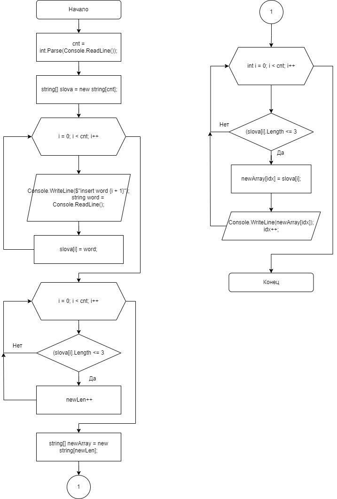
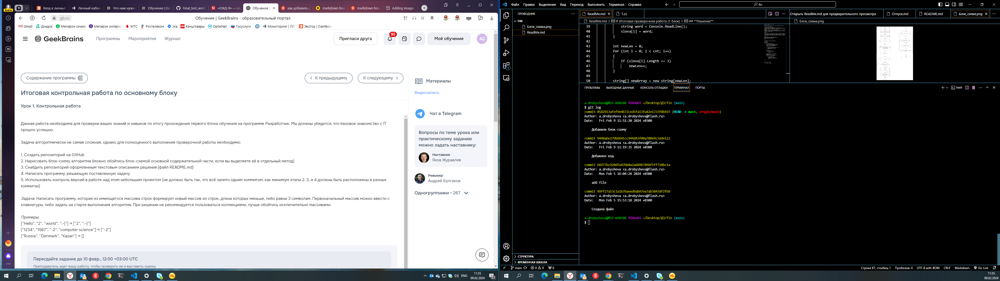

# Итоговая проверочная работа (1 блок)
## **Условия задачи**

Задача алгоритмически не самая сложная, однако для полноценного выполнения проверочной работы необходимо:

1. Создать репозиторий на __GitHub__
2. Нарисовать блок-схему алгоритма _(можно обойтись блок-схемой основной содержательной части, если вы выделяете её в отдельный метод)_
3. Снабдить репозиторий оформленным текстовым описанием решения _(файл __README.md__)_
4. Написать программу, решающую поставленную задачу
5. Использовать контроль версий в работе над этим небольшим проектом _(не должно быть так, что всё залито одним коммитом, как минимум этапы 2, 3, и 4 должны быть расположены в разных коммитах)_

**Задача:**

Написать программу, которая из имеющегося массива строк формирует новый массив из строк, длина которых меньше, либо равна 3 символам. Первоначальный массив можно ввести с клавиатуры, либо задать на старте выполнения алгоритма. При решении не рекомендуется пользоваться коллекциями, лучше обойтись исключительно массивами.

**Примеры:**
```
[“Hello”, “2”, “world”, “:-)”] → [“2”, “:-)”]
[“1234”, “1567”, “-2”, “computer science”] → [“-2”]
[“Russia”, “Denmark”, “Kazan”] → []
```
***

## **Решение**
**Программа решающая поставленную задачу:**
```
using System;
class Program
{
    static void Main(string[] args)
    {
        Console.WriteLine("Insert numbers of words");
        int cnt = int.Parse(Console.ReadLine());
        string[] slova = new string[cnt];

        for (int i = 0; i < cnt; i++)
        {
            Console.WriteLine($"Insert word {i + 1}");
            string word = Console.ReadLine();
            slova[i] = word;
        }

        int newLen = 0;
        for (int i = 0; i < cnt; i++)
        {
            if (slova[i].Length <= 3) 
                newLen++;
        }

        string[] newArray = new string[newLen];
        int idx = 0;
        Console.WriteLine("Result list ");
        for (int i = 0; i < slova.Length; i++)
        {
            if (slova[i].Length <= 3)
            {
                newArray[idx] = slova[i];
                Console.WriteLine(newArray[idx]);
                idx++;
            }
        }
    }
}

```
**Блок-схема алгоритма:**



**Скрин моих коммитов:**

